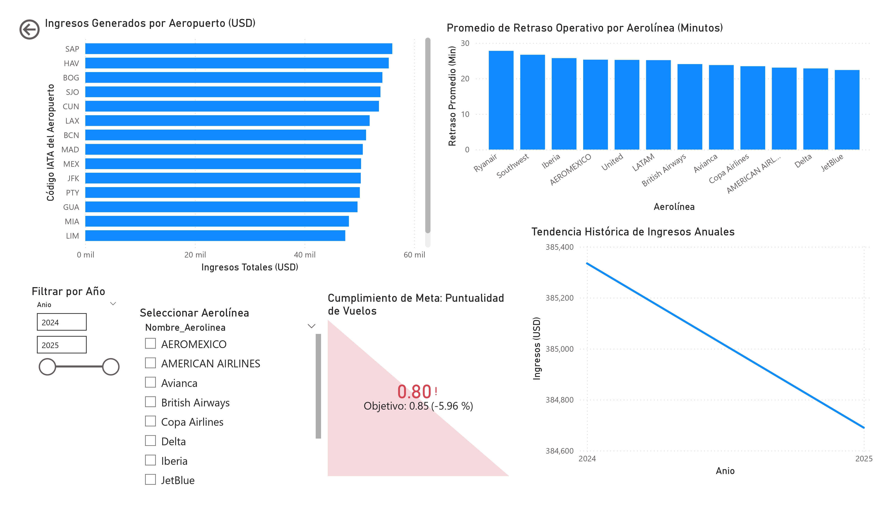

# Práctica 2: Diseño de Dashboard y KPIs con Power BI

**Curso:** Seminario de Sistemas 2
**Estudiante:** Daniel Moisés Chan Pelico
**Carnet:** 201906099

## 1. Diseño del Modelo Tabular

El modelo de datos implementa una arquitectura analítica basada en un Esquema Estrella (Star Schema). La tabla central `Fact_Vuelos` almacena las métricas transaccionales y centraliza las llaves foráneas para su relación con dimensiones conformadas mediante cardinalidad de uno a varios (1:*). 

La tabla `Dim_Aeropuerto` se implementó como una dimensión de rol (Role-playing dimension), gestionando simultáneamente las entidades de origen y destino mediante el manejo de relaciones activas e inactivas en el motor tabular. Se configuró una jerarquía temporal estructurada (Año > Nombre_Mes > Día) sobre la entidad `Dim_Tiempo` para habilitar capacidades de agregación y desglose analítico (drill-down).

## 2. Lógica y Justificación de Medidas DAX

Se implementaron expresiones DAX para calcular las métricas base del negocio y los indicadores de rendimiento:

**Ingresos Totales (Total Revenue):**
```dax
Total Revenue = SUM('Fact_Vuelos'[Precio_Boleto_USD])
```
Cuantifica el ingreso bruto total mediante la adición de la columna de precio de boletos. Representa el valor económico de la operación.

**Retraso Promedio (Avg Delay Min):**
```dax
Avg Delay Min = AVERAGE('Fact_Vuelos'[Retraso_Minutos])
```
Calcula la media de minutos de retraso por registro de vuelo. Actúa como métrica base para identificar ineficiencias en la cadena operativa.

**Porcentaje de Puntualidad (% On-Time Flights):**
```dax
% On-Time Flights = 
VAR TotalVuelos = COUNTROWS('Fact_Vuelos')
VAR VuelosPuntuales = CALCULATE(COUNTROWS('Fact_Vuelos'), 'Fact_Vuelos'[Retraso_Minutos] <= 0)
RETURN DIVIDE(VuelosPuntuales, TotalVuelos, 0)
```
La función altera el contexto de filtro nativo mediante `CALCULATE` para aislar los vuelos con 0 minutos de retraso o salidas anticipadas. El uso de variables optimiza el cálculo del porcentaje, mientras que `DIVIDE` maneja de forma segura las excepciones de división por cero. Constituye la métrica principal para el nivel de servicio.

## 3. Interpretación Estratégica de KPIs y Visualizaciones

* **Cumplimiento de Meta (Puntualidad de Vuelos):** El Indicador Clave de Desempeño (KPI) muestra un nivel de servicio actual del 80% (0.80), lo que representa una desviación negativa del -5.96% frente a la meta estratégica definida del 85% (0.85). El umbral de formato condicional (semáforo) clasifica este resultado en estado crítico (rojo), requiriendo intervención operativa inmediata.
* **Promedio de Retraso Operativo por Aerolínea (Minutos):** El análisis de barras segmenta las ineficiencias, identificando a Ryanair como el principal factor de degradación del KPI de puntualidad, al registrar un retraso promedio que ronda los 28 minutos por vuelo operado.
* **Tendencia Histórica de Ingresos Anuales:** El análisis evolutivo evidencia una contracción operativa y financiera en el paso del ejercicio fiscal 2024 al 2025, validando la necesidad de replantear las estrategias comerciales.
* **Ingresos Generados por Aeropuerto (USD):** Concentración volumétrica de ingresos de naturaleza asimétrica. Hubs como SAP (San Pedro Sula), HAV (La Habana) y BOG (Bogotá) lideran el retorno financiero bajo el contexto de filtro actual.

## 4. Interfaz de Usuario e Interacción

