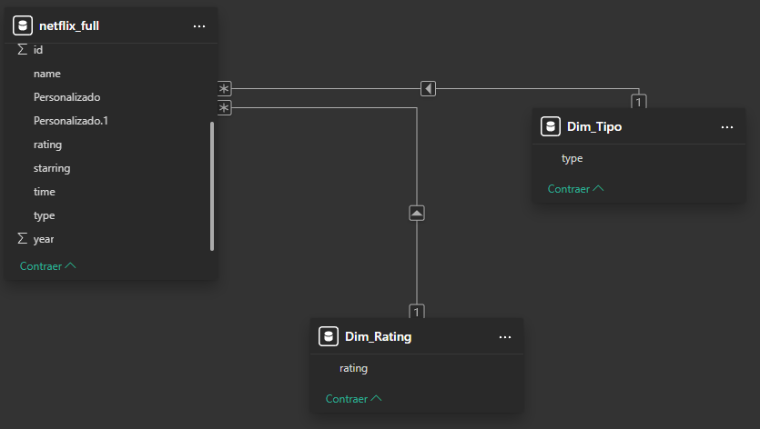
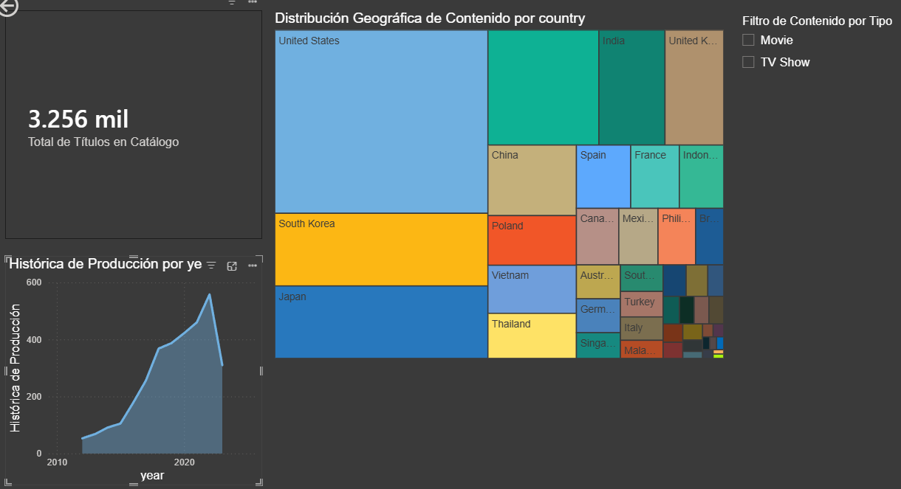

Títulos recomendados para tus 4 visuales (nombres limpios y ejecutivos):

1. **Tarjeta (KPI):** `Total de Títulos en Catálogo`
2. **Gráfico de Áreas:** `Evolución Histórica de Producción por Año`
3. **Treemap:** `Distribución Geográfica de Contenido`
4. **Segmentador:** `Filtro de Contenido por Tipo`

A continuación, el contenido exacto para tu archivo `README.md` generado bajo los parámetros estrictos solicitados. Cópialo y pégalo directamente:

---

# Documentación Técnica: Dashboard Analítico Netflix (Tarea 2.1)

## 1. Especificaciones del Origen de Datos

Dataset extraído del repositorio de Kaggle conteniendo el catálogo histórico de Netflix. Consta de 3,256 registros iniciales estructurados en formato CSV con metadatos sobre títulos, elencos, directores, años de lanzamiento, clasificación y duración.

## 2. Flujo de Transformación (ETL en Power Query)

Se aplicaron técnicas de limpieza y estandarización para garantizar la integridad referencial y exactitud de las métricas:

* **Normalización de Texto:** Ejecución de funciones `Trim` y `Capitalize` en las columnas descriptivas (`country`, `name`) para eliminar espacios en blanco redundantes y unificar formatos de texto, previniendo la duplicidad lógica en las dimensiones.
* **Manejo de Tipos de Datos:** Conversión explícita de campos numéricos (como `year`) a enteros y validación de tipos nulos. Las filas con valores nulos en dimensiones descriptivas se mantuvieron para preservar la integridad de las métricas volumétricas (conteo de IDs).
* **Ingeniería de Características (Duración):** Resolución del conflicto de formato mixto en la columna `time`. Implementación de scripts en lenguaje M para derivar dos nuevas métricas numéricas absolutas:
* Extracción y conversión a enteros de minutos exactos para registros tipo `Movie`.
* Aislamiento numérico de la cantidad de temporadas para registros tipo `TV Show`, filtrando la cadena de texto "Season/Seasons" y horas parciales ("1h 23m").

## 3. Arquitectura del Modelo de Datos

El modelo lógico se implementó bajo un enfoque de **Esquema Estrella (Star Schema)**, aislando la tabla de hechos principal y construyendo dimensiones satélite para optimizar el rendimiento del motor tabular y el filtrado en el reporte:

* `netflix_full`: Tabla de hechos (Fact Table) que almacena la granularidad a nivel de título.
* `Dim_Tipo`: Tabla de dimensión conteniendo los valores únicos de formatos de visualización (Movie, TV Show).
* `Dim_Rating`: Tabla de dimensión conteniendo las clasificaciones por edad estandarizadas.
* **Relaciones:** Se establecieron cardinalidades de uno a varios (1:*) con filtrado unidireccional desde las tablas de dimensiones hacia la tabla de hechos.

## 4. Definición e Interpretación de Visualizaciones (KPIs)

* **Total de Títulos en Catálogo:**
* *Métrica:* Recuento distintivo del campo `id`.
* *Interpretación:* Cuantifica el volumen absoluto de activos digitales disponibles en la plataforma. Sirve como línea base para dimensionar la capacidad de oferta al consumidor final.

* **Evolución Histórica de Producción por Año:**
* *Métrica:* Tendencia temporal de `id` (Eje Y) sobre `year` (Eje X).
* *Interpretación:* Identifica el ciclo de vida de adquisición y producción de contenido. Revela puntos de inflexión históricos donde la estrategia corporativa migró hacia la generación masiva de contenido original.

* **Distribución Geográfica de Contenido:**
* *Métrica:* Proporción volumétrica de títulos distribuidos por `country`.
* *Interpretación:* Mapea la huella de producción global, determinando qué mercados internacionales poseen el mayor peso en el catálogo y justificando las estrategias de localización y licenciamiento regional.

## 5. Capturas de Implementación

